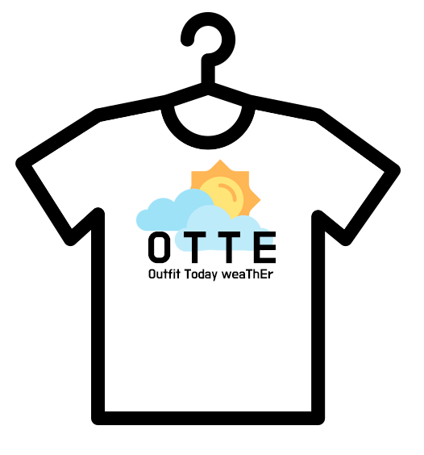

# 옷때?(OTTE?)

## 1. 프로젝트 개요

​	많은 사람들은 날씨에 맞는 옷을 입기 위해서 기온 별 옷차림을 검색한다. 하지만 이렇게 신중하게 옷을 골라 입어도 막상 밖에 나가보면 너무 덥거나 추웠던 경우가 있을 것이다. 사람마다 더위, 추위를 타는 정도와 각자 소유하고 있는 옷 등이 다르므로 우리는 사용자 개인 맞춤에 중점을 두어 "오늘 뭐 입지?"라는 고민을 같이 덜어주고자 한다.

​	'옷때?(OTTE?)'는 **O**utfit **T**oday wea**T**h**E**r의 의미를 가지며, 사용자가 날씨에 맞는 코디를 할 수 있게 도와주는 웹 서비스다. 주요 기능은 다음과 같다.

1. 사용자의 **옷** 정보 저장
   - 옷 사진 업로드에 따른 분류 작업 수행
     - 대분류 : 아우터, 상의, 바지, 치마, 원피스
     - 소분류 : 대분류의 세부 카테고리
2. 사용자의 **코디** 정보(어떤 옷들을 조합하여 입었는지) 저장
3. 사용자의 **코디 리뷰** 정보(언제, 어디서 입었는지, 춥거나 덥지는 않았는지 여부) 저장
4. 오늘의 **날씨에 맞는 코디 추천**
   - 과거 유사한 날씨에 본인이 작성한 코디 리뷰 조회
   - 과거 유사한 날씨에 다른 사용자들이 작성한 긍정적인 리뷰들 중, 
     각 대분류 별 가장 높은 비율을 차지한 소분류 카테고리에 따라 해당 카테고리와 일치하는 사용자의 옷 추천
5. **해외날씨 서비스** 제공
   - 해외 여행 또는 해외 출장 시에도 해당 서비스를 이용할 수 있도록 해외날씨 서비스 제공 

## 2. Abstract

​	Many people search for what to wear before going out in order to find appropriate clothes set for the weather. But even if they go through this process of searching, there are cases where they feel colder or hotter than what they have thought after getting out. Because every people feels different on how hot or cold about the same weather and also has different clothes to choose from, we are trying to help them resolve the problem "What to wear today" by focusing on individual information.

​	'**OTTE?**' stands for **O**utfit **T**oday wea**T**h**E**r, and it is a web service that helps the user to find appropriate clothes set for the weather they are about to face. The main features are as follows.

1. Save the user's **Clothes** information.
   - Classify the uploaded clothes picture.
     - Big categories : Outer, Top, Pants, Skirts, Dress.
     - Small categories : detailed multiple categories inside inside big categories
2. Save the user's **Clothes Set**(what combination of clothes the user wore) information.
3. Save the user's **Clothes Set "Review"**(when & where they wore, whether it was too cold or hot).
4. **Recommend** the clothing set for weather today.
   - Show Clothes Set Reviews written by the user that had the similar weather with today's weather.
   - Relying on 'positive' Clothes Set Reviews written by other users that had the similar weather with today's weather, find which small category of each big categories were the most popular, and show the user's clothes on those categories.
5. Provide **foreign weather service**
   - Users can use OTTE on foreign trips/business trips through foreign weather service

## 3. 소개 영상

<iframe width="560" height="315" src="https://www.youtube.com/embed/9LO2N7AenVQ" frameborder="0" allow="accelerometer; autoplay; encrypted-media; gyroscope; picture-in-picture" allowfullscreen></iframe>

## 4. 1차 중간평가 영상

<iframe width="560" height="315" src="https://www.youtube.com/embed/ursh3OyH09s" frameborder="0" allow="accelerometer; autoplay; encrypted-media; gyroscope; picture-in-picture" allowfullscreen></iframe>

## 5. 2차 중간평가 영상

<iframe width="560" height="315" src="https://www.youtube.com/embed/2W2d1jzT0iw" frameborder="0" allow="accelerometer; autoplay; encrypted-media; gyroscope; picture-in-picture" allowfullscreen></iframe>

## 6. 최종평가 영상

<iframe width="560" height="315" src="https://www.youtube.com/embed/Q411RhkTjcw" frameborder="0" allow="accelerometer; autoplay; encrypted-media; gyroscope; picture-in-picture" allowfullscreen></iframe>

## 7. 시연 영상

<iframe width="560" height="315" src="https://www.youtube.com/embed/ZAAijUxpF6Q" frameborder="0" allow="accelerometer; autoplay; encrypted-media; gyroscope; picture-in-picture" allowfullscreen></iframe>

## 8. 홍보 영상

<iframe width="560" height="315" src="https://www.youtube.com/embed/tdWAHNXE_jo" frameborder="0" allow="accelerometer; autoplay; encrypted-media; gyroscope; picture-in-picture" allowfullscreen></iframe>

## 9. 팀 소개

#### 이경용 교수님

~~~
📧 email: leeky@kookmin.ac.kr
📌 role: 프로젝트 지도교수, 멘토
~~~

#### 황효빈

~~~
📧 email: hyobin0715@kookmin.ac.kr
📌 role: 팀장, AWS 연결, 데이터베이스 구축, API 서버 개발
~~~

#### 송현화

~~~
📧 email: soonghh@kookmin.ac.kr
📌 role: User Interface 디자인, 프론트엔드 개발
~~~

#### 정예빈

~~~
📧 email: gsj4243@kookmin.ac.kr
📌 role: User Interface 디자인, 프론트엔드 개발
~~~

#### 권민수

~~~
📧 email: mageeeeek@gmail.com
📌 role: Project Manager, API 서버 개발, 옷 분류 모델 개발
~~~

#### 이재호

~~~
📧 email: hiljh96@kookmin.ac.kr
📌 role: AWS 연결, API 서버 개발
~~~

#### 주가구

~~~
📧 email: zhoujiaju@kookmin.ac.kr
📌 role: 유닛 테스팅, 로고 제작
~~~
